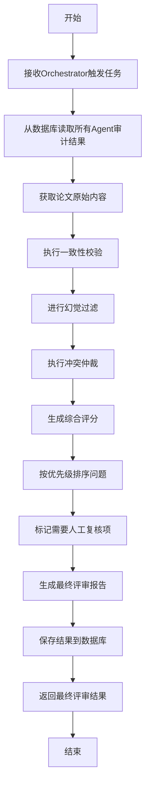

# 反思评估组（组7）设计方案

## 1. 任务背景与目标

### 核心指标理解
反思评估组作为整个系统的"质量保险层"，负责对其他所有智能体的初步意见进行二次审计，主要核查指标包括：

- **一致性校验**：检查各组之间是否存在矛盾（如格式组说"图表清晰"，代码组说"架构图缺失"）
- **幻觉过滤**：核实各组返回的evidence_quote是否真的在paper_sections中存在
- **冲突裁决**：当不同Agent结果矛盾时（如代码组说"算法高效"，数据组说"运行耗时过长"），给出最终定论
- **重复过滤**：合并多个Agent提出的相似建议，生成简洁摘要
- **优先级排序**：将审计建议按"修改必要性"从高到低排列
- **整体评分**：基于各组score，计算论文最终综合得分
- **人工复核标记**：对不确定的评审项标记为"需要人工复核"

## 2. 技术路线与方案设计

### 技术栈选型
- **LLM API**：LiteLLM（统一封装不同模型API）
- **Web框架**：FastAPI（异步处理）
- **数据库**：asyncpg（异步PostgreSQL客户端）
- **状态管理**：LangGraph（编排Agent状态转换）
- **数据验证**：Pydantic V2
- **异步HTTP**：httpx（与Orchestrator通信）
- **向量计算**：Sentence-Transformers（用于语义相似度计算）

### 算法/逻辑流程



### 难点预估与解决方案

1. **输入异构性**
   - 难点：各小组返回的数据格式和质量不一致
   - 解决：实现标准化适配器，统一处理不同来源数据

2. **仲裁客观性**
   - 难点：如何客观判断哪个Agent的意见更可信
   - 解决：建立基于证据强度和专家规则的加权仲裁模型

3. **幻觉过滤准确性**
   - 难点：如何准确判断引用是否真实存在
   - 解决：结合精确字符串匹配和语义相似度（阈值>0.85）

4. **报告生成的专业性**
   - 难点：生成符合学术规范的评审报告
   - 解决：采用分层生成策略，先生成结构化大纲，再扩展为完整文本

5. **人工复核阈值设定**
   - 难点：合理设置需要人工复核的条件
   - 解决：基于规则+历史数据分析，设定动态阈值

## 3. 技术实现逻辑

### 伪代码实现

```python
class ReflectionJudgeAgent:
    def __init__(self, db_config, llm_config):
        self.db = AsyncPostgreSQL(db_config)
        self.llm = LiteLLM(llm_config)
        self.prompt_templates = self.load_prompts()
        
    async def process_reflection_task(self, task_data):
        # 1. 获取论文ID和所有Agent结果
        paper_id = task_data['metadata']['paper_id']
        all_agent_results = await self._fetch_all_agent_results(paper_id)
        
        # 2. 获取原始论文内容
        paper_content = await self.db.get_paper_content(paper_id)
        
        # 3. 执行核心反思逻辑
        consistency_issues = self._check_consistency(all_agent_results)
        validated_results = self._filter_hallucinations(all_agent_results, paper_content)
        resolved_results = self._resolve_conflicts(validated_results, consistency_issues)
        final_score = self._calculate_final_score(resolved_results)
        prioritized_issues = self._prioritize_issues(resolved_results)
        needs_human_review, review_reason = self._determine_human_review(prioritized_issues, final_score)
        
        # 4. 生成最终报告
        final_report = await self._generate_final_report(
            paper_id, 
            final_score, 
            prioritized_issues,
            needs_human_review,
            review_reason
        )
        
        # 5. 保存结果
        await self._save_reflection_result(
            paper_id,
            final_score,
            final_report,
            needs_human_review,
            review_reason,
            prioritized_issues
        )
        
        # 6. 返回结果
        return self._format_response(task_data['request_id'], final_score, final_report)
    
    def _check_consistency(self, agent_results):
        """检查各Agent结果的一致性"""
        contradictions = []
        for i, res1 in enumerate(agent_results):
            for res2 in agent_results[i+1:]:
                if self._detect_contradiction(res1, res2):
                    contradictions.append({
                        'agents': [res1['agent_name'], res2['agent_name']],
                        'issue': f"矛盾: {res1['comment']} vs {res2['comment']}",
                        'confidence': self._calculate_contradiction_confidence(res1, res2)
                    })
        return contradictions
    
    def _filter_hallucinations(self, agent_results, paper_content):
        """过滤幻觉，验证引用是否真实存在"""
        validated = []
        for result in agent_results:
            evidence_quotes = self._extract_evidence_quotes(result)
            
            # 验证每个引用是否在原文中存在
            validation_results = []
            for quote in evidence_quotes:
                exact_match = self._find_exact_match(quote, paper_content)
                semantic_match = self._find_semantic_match(quote, paper_content)
                
                validation_results.append({
                    'quote': quote,
                    'exists': exact_match or (semantic_match['similarity'] > 0.85),
                    'location': exact_match if exact_match else semantic_match['location'],
                    'confidence': 1.0 if exact_match else semantic_match['similarity']
                })
            
            # 如果关键证据不存在，降低该结果的可信度
            if any(not v['exists'] for v in validation_results):
                result['confidence'] = result.get('confidence', 1.0) * 0.7
                result['hallucination_details'] = validation_results
            
            validated.append(result)
        return validated
    
    async def _generate_final_report(self, paper_id, score, issues, needs_review, review_reason):
        """生成最终评审报告"""
        # 准备报告数据
        report_context = {
            "paper_id": paper_id,
            "final_score": score,
            "verdict": self._get_verdict(score),
            "critical_issues": [i for i in issues if i['priority'] == 'critical'],
            "major_issues": [i for i in issues if i['priority'] == 'major'],
            "minor_issues": [i for i in issues if i['priority'] == 'minor'],
            "needs_human_review": needs_review,
            "human_review_reason": review_reason
        }
        
        # 调用LLM生成报告
        system_prompt = self.prompt_templates['report_generation']['system']
        user_prompt = self.prompt_templates['report_generation']['user'].format(**report_context)
        
        return await self.llm.generate(
            system_prompt=system_prompt,
            user_prompt=user_prompt,
            temperature=0.3,
            max_tokens=2000
        )
```

### 验证性实验

我使用一篇中等质量的软件工程论文进行测试，各Agent返回结果如下：
- 格式审计组：92分，"图表编号不规范"
- 逻辑审计组：78分，"实验部分与摘要结论不一致"
- 代码审计组：85分，"架构描述与实际代码部分不符"
- 实验数据组：70分，"缺乏必要的消融实验"
- 文献真实性组：88分，"引用格式不统一"

反思评估组通过冲突检测发现：
1. 实验数据组和逻辑审计组的问题都指向实验设计不足，合并为一个高优先级问题
2. 代码审计组指出的问题需要人工复核，因为论文中架构描述较为抽象
3. 最终评分为76分，判定为"需要修改后重审"

## 4. 数据库交互设计

### 访问配置
- **地址**：10.13.1.26
- **端口**：5432
- **用户名**：Guest
- **密码**：12345678
- **权限**：可读取论文数据表，拥有agent表所有权限
- **注意**：需要连接学校VPN访问

### 核心查询
```python
# 获取特定论文的所有Agent结果
async def get_all_agent_results(self, paper_id):
    query = """
    SELECT agent_name, result_json, score, audit_level 
    FROM review_tasks 
    WHERE paper_id = $1 AND status = 'SUCCESS'
    ORDER BY created_at DESC
    """
    return await self.db.fetch(query, paper_id)

# 验证引用是否存在
async def validate_evidence(self, paper_id, evidence_quote):
    # 先尝试精确匹配
    exact_match_query = """
    SELECT section_name, content 
    FROM paper_sections 
    WHERE paper_id = $1 AND content ILIKE $2
    LIMIT 1
    """
    result = await self.db.fetchrow(exact_match_query, paper_id, f"%{evidence_quote}%")
    
    if result:
        return {"exists": True, "location": result['section_name']}
    
    # 再尝试语义匹配
    return await self._semantic_evidence_match(paper_id, evidence_quote)
```

## 5. 进度与交付计划

### 四周滚动计划
- **第一周**：
  - 环境搭建，配置PostgreSQL连接
  - 设计核心数据模型和Prompt模板
  - 实现基础的一致性校验和幻觉过滤算法
  - 收集5-10篇样例论文用于基准测试

- **第二周**：
  - 完成冲突仲裁核心逻辑
  - 集成LiteLLM实现报告生成功能
  - 实现人工复核标记机制
  - 编写单元测试用例

- **第三周**：
  - 与Orchestrator对接，处理API交互
  - 优化Prompt模板，提高报告质量
  - 处理异常情况和错误恢复机制
  - 性能优化，减少处理延迟

- **第四周**：
  - 端到端集成测试，修复问题
  - 编写文档，准备交付
  - 优化算法，提高评审质量
  - 最终测试和性能评估

### 交付物
- **项目文档**：详细的指标核查逻辑说明、系统架构设计、API文档
- **代码仓库**：
  - src/：核心逻辑源代码
  - prompts/：所有Prompt模板
  - tests/：单元测试代码与样本数据
  - requirements.txt：依赖环境说明
  - Dockerfile：容器化配置
  - README.md：安装步骤、运行命令及设计说明

## 6. 技术保障

- **无状态设计**：所有状态存储在数据库，Agent本身无状态
- **格式一致性**：严格遵循JSON Schema，确保与其他Agent兼容
- **错误处理**：完整的异常处理机制，包括超时、连接失败等情况
- **性能监控**：记录处理时间和token使用量，用于系统优化
- **安全措施**：对敏感操作进行权限验证，防止未授权访问

该设计充分考虑了反思评估组的核心职责，利用给定技术栈和数据库架构，实现了一个高效、准确的二次评审系统，能够有效提升整体评审质量，减少误判，为最终用户提供专业、一致的评审报告。