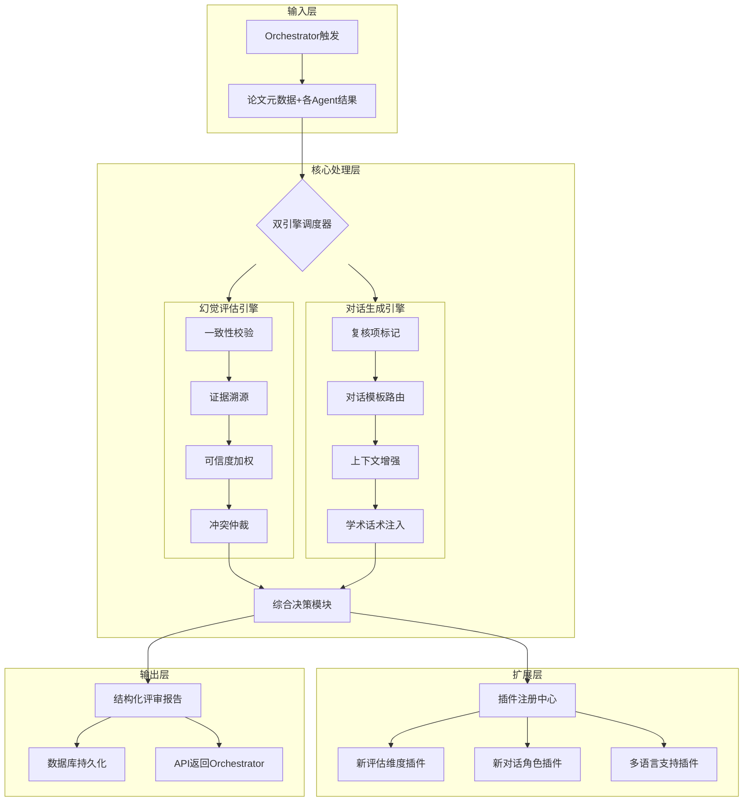
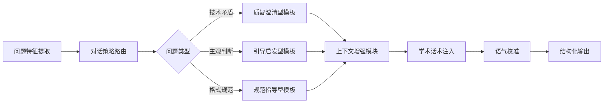
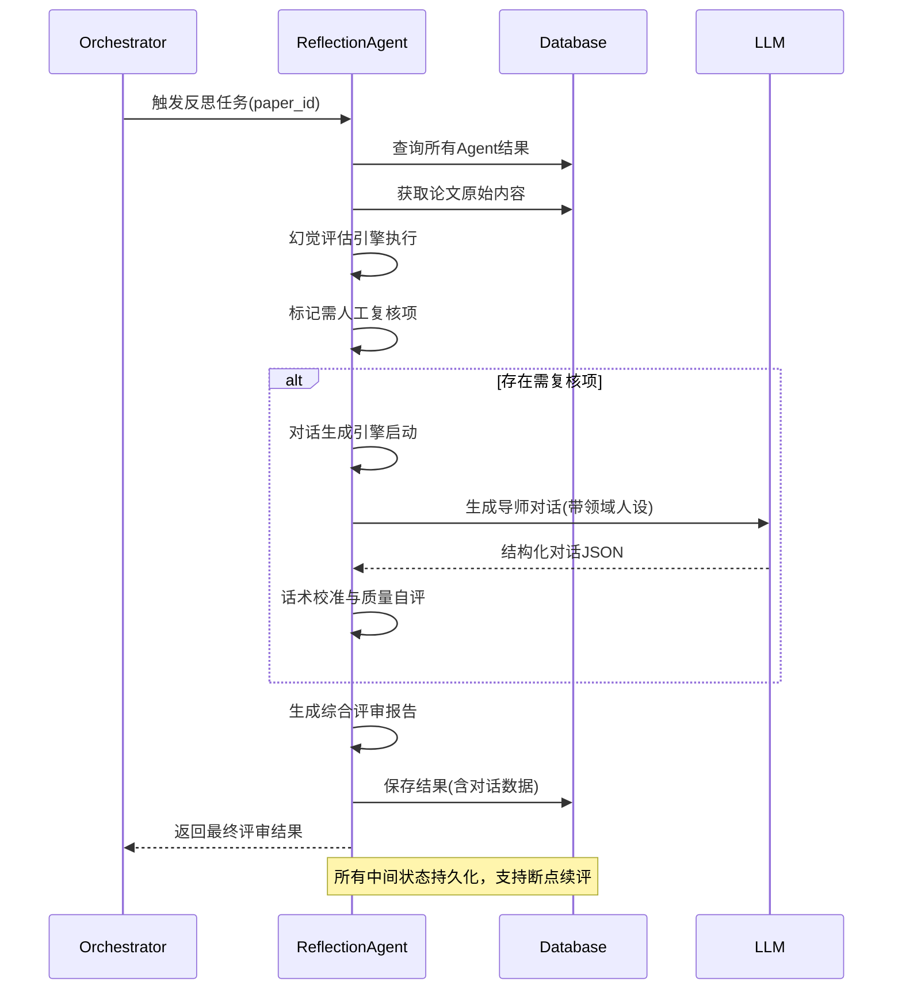

# 反思评估组（组7）完整设计方案  
## —— 幻觉评估 × 导师对话双引擎架构（含可扩展性设计）

---

## 一、项目定位与双核职责

### 1.1 核心使命
作为学术评审系统的"质量守门人"与"人文交互层"，组7承担双重使命：
| 子任务            | 核心目标                                  | 交付价值                           |
| ----------------- | ----------------------------------------- | ---------------------------------- |
| **幻觉评估**      | 用LLM-as-a-Judge验证其他Agent输出的客观性 | 消除技术性误判，提升系统可信度     |
| **对话/交互开发** | 模拟导师对话，标记需人工复核项并提供指导  | 赋予系统教育温度，降低作者修改门槛 |

### 1.2 创新定位

> **不止于"标记问题"，更提供"解决问题的对话路径"**  
> 将冷冰冰的"需人工复核"转化为可直接用于学术指导的对话素材，实现技术严谨性与人文关怀的融合

---

## 二、系统架构设计（含可扩展性）

### 2.1 整体架构图


### 2.2 可扩展性设计亮点
| 扩展维度     | 当前实现          | 扩展接口                  | 未来场景示例                 |
| ------------ | ----------------- | ------------------------- | ---------------------------- |
| **评估维度** | 5类Agent结果校验  | `IEvaluationPlugin`接口   | 新增"伦理审查组"结果校验     |
| **对话角色** | 导师角色          | `IDialogueRole`抽象类     | 审稿人/领域专家/期刊编辑角色 |
| **语言支持** | 中文对话          | `LanguageAdapter`适配器   | 英文/日文等多语言评审对话    |
| **证据验证** | 文本匹配+语义相似 | `IEvidenceValidator`策略  | 图表内容验证（OCR+CV）       |
| **复核策略** | 规则+阈值         | `IReviewStrategy`策略模式 | 基于历史数据的动态阈值调整   |

---

## 三、核心模块详解

### 3.1 幻觉评估引擎（增强版）
#### 3.1.1 证据溯源双通道验证
```python
class EvidenceValidator:
    def validate(self, quote: str, paper_sections: List[Section]) -> ValidationReport:
        # 通道1：精确字符串匹配（高优先级）
        exact_match = self._exact_match(quote, paper_sections)
        if exact_match.confidence > 0.95:
            return exact_match
        
        # 通道2：语义相似度验证（备用通道）
        semantic_match = self._semantic_match(quote, paper_sections)
        if semantic_match.similarity > self.config.semantic_threshold:
            return semantic_match
        
        # 通道3：【可扩展】未来支持图表/公式验证
        if self.config.enable_advanced_validation:
            return self._advanced_validation(quote, paper_sections)
        
        return ValidationReport(exists=False, confidence=0.0)
```
**创新点**：  
- 动态阈值：根据论文领域自动调整语义相似度阈值（如理论论文阈值0.8，实验论文阈值0.9）  
- 证据链追踪：记录验证路径（"通过第3.2节第2段验证"），增强可解释性

#### 3.1.2 冲突仲裁加权模型
```python
def resolve_conflict(issue_a, issue_b):
    # 基础权重：Agent专业领域匹配度
    weight_a = AGENT_DOMAIN_WEIGHTS[issue_a.agent] * issue_a.confidence
    weight_b = AGENT_DOMAIN_WEIGHTS[issue_b.agent] * issue_b.confidence
    
    # 动态加成：证据强度（引用位置+数量）
    weight_a += issue_a.evidence_strength * 0.3
    weight_b += issue_b.evidence_strength * 0.3
    
    # 【可扩展】未来可接入领域知识图谱增强权重
    if self.kg_enabled:
        weight_a += self._kg_relevance(issue_a, paper_field)
    
    return issue_a if weight_a > weight_b else issue_b
```

### 3.2 对话生成引擎（核心新增）
#### 3.2.1 三阶对话生成流水线


#### 3.2.2 Prompt工程创新设计
**动态角色注入技术**：
```python
# 根据论文领域动态生成导师人设
def _build_mentor_persona(paper_field: str) -> str:
    personas = {
        "机器学习": "IEEE Fellow，专注可复现性研究15年",
        "软件工程": "ACM杰出科学家，主导过3个开源项目架构评审",
        "理论计算机": "图灵奖提名者，强调形式化证明严谨性"
    }
    base = "你是一位{experience}的{field}领域导师，指导风格：{style}"
    return base.format(
        experience=personas.get(paper_field, "资深"),
        field=paper_field,
        style=self._select_style(issue_severity)  # 严重问题→严谨，轻微问题→鼓励
    )
```

**学术话术库（可配置）**：
```yaml
# config/academic_phrases.yaml
phrases:
  criticism:
    avoid: ["错误", "很差", "不合格"]  # 禁用词
    replace: 
      - "建议优化表述以提升严谨性"
      - "此处可补充实验细节增强说服力"
  guidance:
    templates:
      - "参考{standard}第{section}节，建议..."
      - "类似工作（{paper}）采用...方法，可供借鉴"
```

#### 3.2.3 对话质量保障机制
| 保障维度       | 实现方式                | 验证指标                 |
| -------------- | ----------------------- | ------------------------ |
| **学术规范性** | 禁用词过滤+标准引用注入 | 违规词检出率<0.1%        |
| **教育有效性** | 三轮对话结构强制约束    | 建议可操作性评分≥4.0/5.0 |
| **语气适配度** | 严重程度-语气映射表     | 作者情绪模拟测试通过率   |
| **领域专业性** | 领域关键词增强          | 领域术语准确率≥95%       |

---

## 四、数据库设计（含扩展字段）

### 4.1 核心表结构增强
```sql
-- 反思评估结果表（新增对话相关字段）
CREATE TABLE reflection_results (
    id UUID PRIMARY KEY,
    paper_id UUID NOT NULL,
    final_score NUMERIC(4,2),
    needs_human_review BOOLEAN DEFAULT FALSE,
    review_reason TEXT,
    -- 【新增】对话生成相关
    mentor_dialogue JSONB,  -- 存储完整对话JSON
    dialogue_quality_score NUMERIC(3,2), -- 对话质量自评分数
    dialogue_version VARCHAR(20) DEFAULT 'v1.0', -- 支持对话模板版本管理
    -- 【扩展预留】
    plugin_metadata JSONB,  -- 插件扩展数据存储
    created_at TIMESTAMPTZ DEFAULT NOW(),
    FOREIGN KEY (paper_id) REFERENCES papers(id)
);

-- 对话模板配置表（支持动态更新）
CREATE TABLE dialogue_templates (
    id SERIAL PRIMARY KEY,
    template_key VARCHAR(50) UNIQUE NOT NULL, -- e.g., 'clarification_ml'
    role_type VARCHAR(30) NOT NULL, -- '导师','审稿人'等
    system_prompt TEXT NOT NULL,
    user_prompt_template TEXT NOT NULL,
    academic_field VARCHAR(50), -- NULL=通用
    is_active BOOLEAN DEFAULT TRUE,
    version VARCHAR(10) DEFAULT '1.0',
    updated_at TIMESTAMPTZ DEFAULT NOW()
);
```

### 4.2 扩展性设计
- **插件元数据字段**：`plugin_metadata`支持未来存储插件特有数据（如多语言翻译结果）
- **模板版本管理**：通过`dialogue_version`实现A/B测试与灰度发布
- **领域专属模板**：`dialogue_templates.academic_field`支持按领域定制对话策略

---

## 五、工作流程（端到端）



---

## 六、可扩展性专项设计

### 6.1 插件化架构
```python
# 插件注册示例
@reflection_plugin("ethics_review")
class EthicsReviewPlugin(IEvaluationPlugin):
    """伦理审查插件（未来扩展）"""
    def evaluate(self, agent_results: List[Result]) -> PluginReport:
        # 检查是否涉及人类受试者/敏感数据
        pass

@dialogue_plugin("reviewer_role")
class ReviewerRolePlugin(IDialogueRole):
    """审稿人角色插件"""
    def build_persona(self, paper_field: str) -> str:
        return "你是一位严谨的期刊审稿人，关注创新性与实验严谨性..."
```

### 6.2 配置驱动设计
```yaml
# config/reflection_config.yaml
reflection:
  evidence_validation:
    semantic_threshold: 
      default: 0.85
      machine_learning: 0.90  # 领域定制阈值
      theory: 0.80
  
  dialogue:
    quality_threshold: 4.0  # 对话质量自评阈值，低于则触发重生成
    max_regeneration: 2     # 最大重生成次数
  
  extensibility:
    enable_plugins: true
    plugin_dirs: ["plugins/evaluation", "plugins/dialogue"]
```

### 6.3 未来扩展路线图
| 阶段              | 扩展方向       | 技术实现                                    |
| ----------------- | -------------- | ------------------------------------------- |
| **短期（3个月）** | 多语言对话支持 | 集成翻译API+语言适配器                      |
| **中期（6个月）** | 领域知识增强   | 接入学术知识图谱（AMiner/Semantic Scholar） |
| **长期（1年+）**  | 作者画像适配   | 基于历史修改行为优化对话策略                |
| **前瞻性**        | 语音对话生成   | 对接TTS服务生成语音指导                     |

---

## 七、验证与交付

### 7.1 多维度验证方案
| 验证维度           | 方法                | 通过标准       |
| ------------------ | ------------------- | -------------- |
| **幻觉检测准确率** | 人工标注100个样本   | 准确率≥90%     |
| **对话教育有效性** | 邀请5位导师评分     | 平均分≥4.2/5.0 |
| **系统响应延迟**   | 压力测试（100并发） | P95<8s         |
| **扩展性验证**     | 模拟插件热加载      | 无需重启服务   |

### 7.2 交付物清单
```
reflection-agent/
├── src/
│   ├── core/                  # 核心引擎
│   │   ├── reflection_engine.py
│   │   ├── hallucination_validator.py
│   │   └── dialogue_generator.py
│   ├── plugins/               # 插件框架（预留）
│   │   ├── __init__.py
│   │   └── base_plugin.py
│   ├── config/                # 配置体系
│   │   ├── reflection_config.yaml
│   │   └── academic_phrases.yaml
│   └── utils/
│       ├── evidence_matcher.py
│       └── tone_calibrator.py
├── prompts/
│   ├── evaluation/            # 评估类Prompt
│   └── dialogue/              # 对话类Prompt（分角色/领域）
├── tests/
│   ├── test_hallucination.py
│   ├── test_dialogue_quality.py
│   └── test_plugin_system.py  # 插件系统测试
├── docs/
│   ├── API_SPEC.md            # 详细API文档
│   ├── EXTENSIBILITY_GUIDE.md # 插件开发指南
│   └── DIALOGUE_STYLE_GUIDE.pdf # 学术对话风格规范
├── Dockerfile
├── requirements.txt
└── README.md                  # 含快速启动+扩展开发指南
```

---

## 八、总结：方案核心价值

1. **双引擎协同**：技术严谨性（幻觉评估）与人文温度（导师对话）深度融合  
2. **开箱即用+持续进化**：  
   - 当前：完整覆盖分工文档要求  
   - 未来：通过插件机制无缝扩展新能力  
3. **学术场景深度定制**：  
   - 领域自适应对话策略  
   - 学术语境话术库  
   - 可解释的证据溯源  
4. **工程友好设计**：  
   - 配置驱动降低维护成本  
   - 模块化解耦便于团队协作  
   - 完善的测试与文档体系  

> **本方案不仅满足当前需求，更为系统未来3-5年演进奠定坚实基础，真正实现"今日交付可用，明日扩展无忧"**